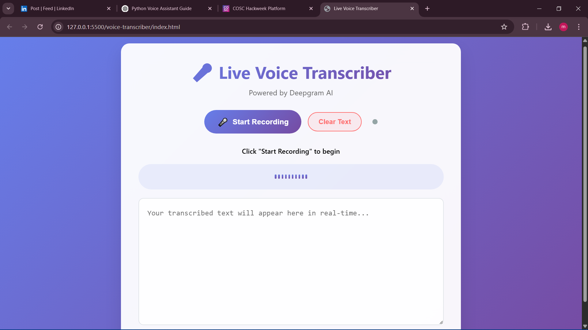

# 🎤 Live Voice Transcriber

A browser-based voice transcription tool powered by **Deepgram API**.  
Built with HTML, CSS, and JavaScript – this app allows you to:

### ✅ Features
- 🎙️ Start/stop live voice recording
- 🔊 Real-time transcription displayed on screen
- 📉 Audio visualizer animation
- 🟢 Live connection indicator
- 🚨 Error handling and status updates
- 🎛️ Stylish, mobile-responsive UI

### 🌐 How It Works
- Uses `navigator.mediaDevices.getUserMedia()` to capture mic input
- Streams audio to Deepgram via WebSocket
- Displays real-time transcription in a styled text area

### 📦 Tech Used
- HTML5 / CSS3
- JavaScript (Vanilla)
- Deepgram API for transcription

### 🚀 How to Run
1. Open `index.html` in a modern browser (Chrome/Firefox).
2. Enter your Deepgram API key in the code.
3. Click **Start Recording** and speak.
4. View live transcription and copy it if needed.

> ⚠️ Note: Replace the API key in the script for it to work properly.

### 📸 Screenshot
 

### 🔐 API Key Setup
Replace this line in `index.html`:
```javascript
this.apiKey = 'YOUR_DEEPGRAM_API_KEY_HERE';
