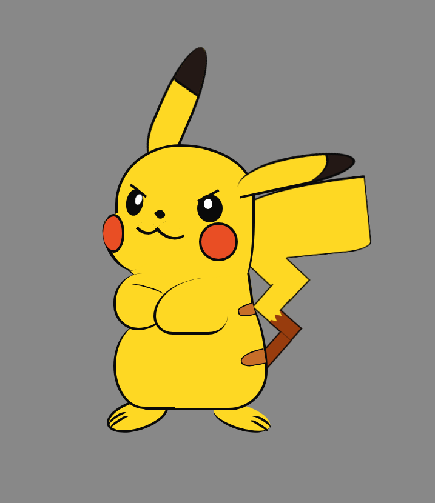

# 🎨 Pure HTML & CSS Character Design

This project showcases a famous character  Pikachu designed using **only HTML and CSS** — no images, no SVGs, no background URLs. Just the power of `div`, `span`, and creative CSS styling!

## 🚀 Features

- 100% pure HTML & CSS
- No images, no SVGs, no external assets
- Uses:
  - `div` and `span` elements
  - CSS properties: `background`, `border-radius`, `box-shadow`, `transform`, `position: absolute`, etc.
- Fully responsive on modern browsers

## 📁 Project Structure
📁project/
┣ 📄 index.html
┣ 📄 style.css

## 🛠️ How It Works

The character is built entirely with nested `div` and `span` tags. Each shape (like eyes, ears, hat, or face) is a styled box with specific dimensions, colors, border-radius, and transforms to match the character's features.

## 👀 Preview

> You can open `index.html` in your browser to view the design.  

Created with ❤️ using just HTML & CSS.

